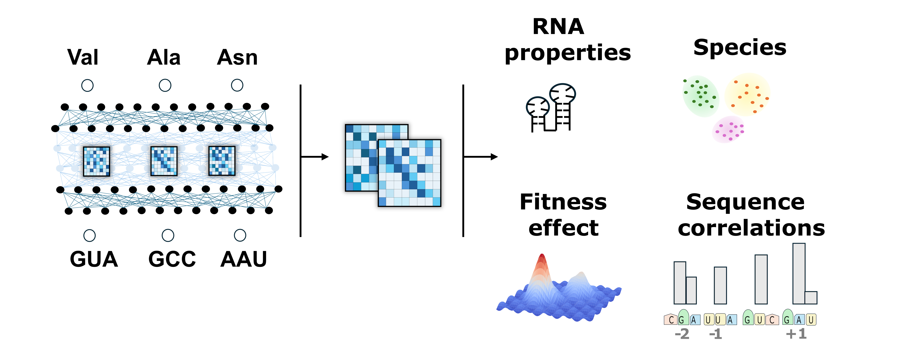

# CaNAT: Decoding synonymous codon selection with a transformer model
Codon from Amino Acid with a Non-Autoregressive Transformer

Predicts codons and associated confidence score from amino acid sequences.


## Installation
```bash
git clone https://github.com/Andre-lab/CaNAT.git
cd CaNAT

Create a Conda environment and install necessary packages:

```bash
conda env create -f -n canat

# Activate the environment
conda activate canat
conda install pytorch=2.2.1 -c pytorch
conda install pandas=2.2.1
pip install -e .
```


## Usage / Inference

Run the inference code for an input fasta file and output a prediction file. 
Example for TEM1 
Input file example:  TEM1.fasta
Output file example: TEM1_prediction/TEM1.csv

```bash

# Run the inference script
python network/scripts/CaNAT/inference.py -p network/scripts/CaNAT/parameters_CaNAT.pt -i TEM1.fasta -o TEM1.prediction/
```

Output is a file with the same number of columns as the input amino acid sequence. 
The first line lists all codons. 
Each cell contains the predicted value for a codon at a given position. 
Confidence scores are calculated by applying the softmax to each row.
